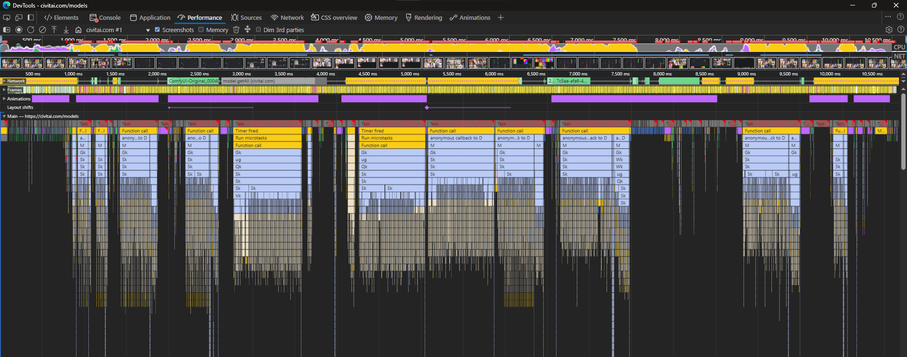
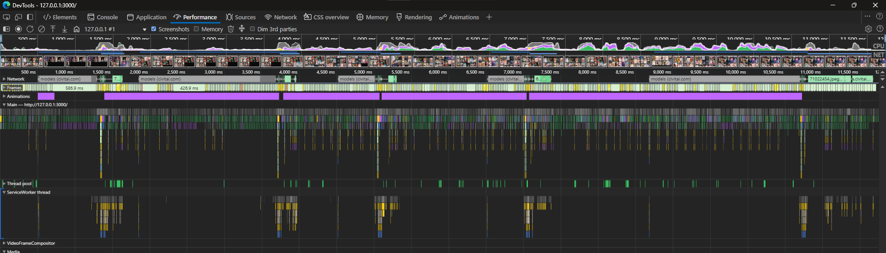

# CivitAI Lite Viewer

View a list of [CivitAI models](https://civitai.com/models) without lags!

## Features

- **Optimization**: Don't do stupid things while scrolling
- **Localization**: supports localization (currently only 4 languages, but if you need a specific language, just create an issue)

## How to use?

1. Open the page at the link [CivitAI Lite Viewer](https://dangarte.github.io/civitai-lite-viewer/)
2. Done

---

Unofficial CivitAI frontend created by **Dangart**
Powered by [CivitAI public API](https://developer.civitai.com/docs/api/public-rest)

---

## Performance

The performance tab in the developer tools says that CivitAI does a lot of unnecessary things while you're just scrolling, why?

There is nothing to do, just wait for the server to respond and insert it when it is ready...

Both screenshots show simple scrolling (around 10 seconds)
