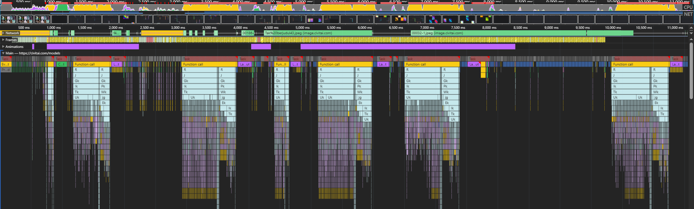
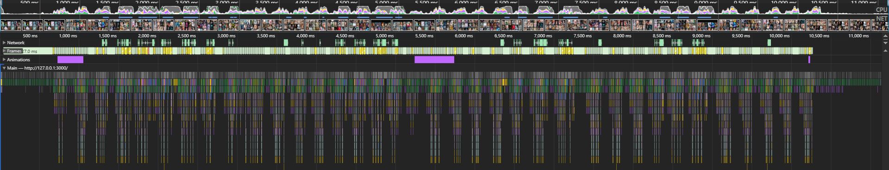

# CivitAI Lite Viewer

View a list of CivitAI models without lags!

---

Unofficial CivitAI frontend created by **Dangart**
 
Powered by [CivitAI public API](https://developer.civitai.com/docs/api/public-rest)
 
Original site [civitai.com](https://civitai.com/)

---

## Features

- **View**: Ability to view list of models, model pages, images generated by these models and their information about generation. *without lags*.
- **Optimization**: Don't do stupid things while scrolling.
- **Localization**: supports localization (currently only 4 languages, but if you need a specific language, just create an issue).

## How to use?

Open the page at the link [CivitAI Lite Viewer](https://dangarte.github.io/civitai-lite-viewer/)

## Performance

The performance tab in the developer tools says that CivitAI does a lot of unnecessary things while you're just scrolling, why?

While scrolling, you don't need to do anything heavy, just put new cards in the field of view...

    
     
    <em>
        Just scrolling through the loaded page with the list of models
         
        civitai, ~10 seconds, 06/25/2025
    </em>

    
     
    <em>
        Just scrolling through the loaded page with the list of models
         
        civitai-lite-viewer, ~10 seconds, 06/25/2025
    </em>

